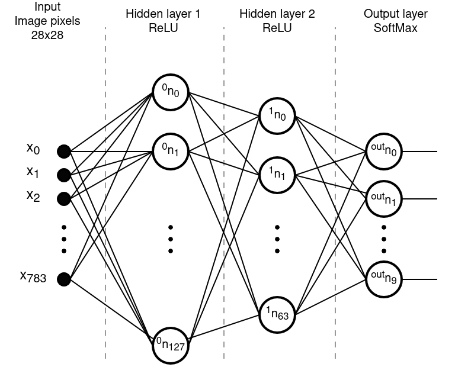

# **Handwritten digit recognition - Backpropagation Learning, Optimization, and Dropout**
### Author: `Dalibor Kříčka`
### 2024, Brno

Note: This project was part of the course _Soft Computing_ at BUT FIT.

---

## **Task Description**
This project aims to implement a simple neural network for classifying handwritten digits and to demonstrate its learning process using the _backpropagation_ method without using tools like PyTorch or TensorFlow. The learning process will be showcased through a GUI application featuring plots of the loss function values and the accuracy of the trained model over individual epochs. Besides the learning itself, the aim is also to present the impact of _optimization algorithms_, the effect of the _dropout_ technique, and the classification of user-drawn digits using specific trained models.

## **Data, Neural Network, and Backpropagation**
### **MNIST Dataset**
The training of the neural network is based on the existing MNIST dataset, which contains 60,000 training images of handwritten digits with fixed dimensions of 28x28 pixels. The test set consists of 10,000 samples. Each sample in the MNIST database comes with a corresponding label specifying the digit shown in the image.

To maintain the generalization ability of the trained model, the training and testing digits were written by several hundred different individuals. The groups of people contributing to the training and testing datasets are disjoint, ensuring that the model's accuracy is evaluated on previously unseen data.

The pixel values in the original dataset range from 0 to 255, representing different shades of gray. However, for this project and for the later demonstration of classifying user-drawn digits, all nonzero pixels are converted to the value 1. This means that image pixels are labeled as colored (value 1) or uncolored (value 0).

### **Neural Network Structure**
As part of the project solution, a feedforward neural network (acyclic, with connections only between adjacent layers) is implemented to classify an input image of a handwritten digit.
The input consists of 784 pixel values (0 or 1), and the output is the probability for each digit (0 to 9) that the given input image represents that particular digit according to the trained model.
The network consists of two hidden layers using ReLU activation functions. The first hidden layer contains 128 neurons, and the second includes 64 neurons. The output layer implements the SoftMax activation function and consists of exactly 10 neurons, each representing a probability output for one of the digits.
Throughout the network, a linear basis function is used. Cross-entropy is used as the model's objective function (loss function L).
The network structure is illustrated in the diagram shown in image 1.

> **Img. 1:** Neural Network Diagram for Handwritten Digit Classification

### **Backpropagation**
Backpropagation is an algorithm for training neural networks by backward propagation of the gradient of the loss function. "Training" here refers to adjusting weights and biases so that the model can correctly predict results even for previously unseen data (known as generalization).
The goal of training is to minimize the loss function using gradient descent. Gradient descent is a method where the directions of the steepest decrease of the loss function are determined using the gradients of neurons, and the network parameters are adjusted accordingly.

#### MBGD – Mini-Batch Gradient Descent
MBGD is an approach to gradient descent where the update of the network parameters is performed only after processing a predefined number of randomly selected elements from the training dataset.
This approach was chosen for the implementation of this project. MBGD is a compromise between the fast convergence of Stochastic Gradient Descent (SGD) and the stable descent (MGD).
The batch size affects the training process:
* smaller batches are computationally less demanding and lead to faster convergence but cause greater oscillations on the way to the minimum of the loss function
* larger batches behave oppositely

#### Adam
Adam is an optimization algorithm that dynamically adjusts the learning rate for each network parameter by combining the principles of momentum and the adaptive averaging of squared gradients.
In training the presented neural network, Adam shows significant improvement in convergence compared to training without optimization. However, compared to AMSGrad, Adam converges more slowly, which results in a higher final loss (see Image 2).
Thus, Adam is powerful, but even over longer runs, it may not be as stable as AMSGrad.

#### AMSGrad
AMSGrad is based on the Adam algorithm, with the difference that AMSGrad uses the maximum of past and current squared gradients for updates.
AMSGrad achieves a much faster and stably lower loss than Adam, confirming its ability to handle better persistent issues such as skipping over optimal points.
When training the aforementioned neural network, AMSGrad clearly proves to be the most effective optimizer, as it maintains a consistently low loss even during long-term training (see Image 2).

> **Img. 2:** Loss evolution during neural network training for different optimization algorithms
(Model 1 – without optimization, Model 2 – Adam, Model 3 – AMSGrad), where the learning rate = 0.001 and batch size = 128.

#### Dropout
Dropout is a technique where, during training, inputs or neurons in the hidden layers are randomly deactivated with a certain probability, with the selection being re-evaluated at each step.
This technique is used to prevent overfitting of the neural network.
In the network training presented in this project, the dropout effect is mainly observed as models trained with dropout achieving higher accuracy on previously unseen data despite having higher loss function values.

## **Installation and Application Control**
### **Installation, Dataset Download, and Launch**
The required Python libraries (_numpy_ and _matplotlib_) can be installed, and the datasets for model training can be downloaded by running the script `install_and_run.sh`, which also launches the application afterward (the library installation script requires password authentication).
To launch the application without reinstalling, run the script `run.sh`.

### **Application Control**

The graphical user interface (GUI) of the application was implemented in Python using the _numpy_ and _PyQt5_ libraries.
The application has two main tabs: **Train** and **Classify**.

#### Train tab

The Train tab allows users to train models according to selected parameters, including step-by-step training.
This tab can be divided into sections A–F (see Image 3), with their functions described as follows:

- A – Setting parameters for up to three models to be trained simultaneously in one training run.
Ability to disable individual models for the run (checkbox next to "Model X").
For each model, you can set: learning rate (LR), batch size, number of epochs, custom model name (under which the trained model will be saved), optimization algorithm, enabling/disabling of dropout, and dropout probabilities for input and hidden layers.

- B – Option to enable plotting of model accuracy graphs across epochs (see Section D).
Enabling this option significantly slows down training due to accuracy evaluation on test data after each training step.

- C – Control buttons for the training demonstration:

   - Start/Reset – Resets results from previous training and initializes models according to the parameter settings in Section A.

   - Train step – Executes one epoch for all active models and stops training.

   - Train full – Starts training of all active models from the current epoch to the final one and saves models to files.

   - Stop – Stops training in the current epoch and saves models to files.

- D – A graph showing the classification accuracy of all active models on test data across epochs.

- E – A graph showing the loss function values of all active models across epochs.

- F – A text output providing specific numerical values presented in the graphs.

> **Img. 3:** Preview of the Train tab divided into UI sections A–F.

#### Classify tab

The Classify tab allows the user to draw a digit with the mouse directly inside the application and classify it using a selected pre-trained model.
This tab can be divided into sections A–E (see Image 4), with their functions described as follows:

- A – A canvas where digits can be drawn by pressing the right mouse button and dragging.
The left mouse button can be used as an "eraser."

- B – A button to clear the canvas and classification results.

- C – A selection menu to choose a previously trained model for classification by its name.

- D – A button to evaluate the classification of the digit drawn on the canvas using the selected model.

- E – The classification results.

> **Img. 4:** Preview of the Classify tab divided into UI sections A–E.